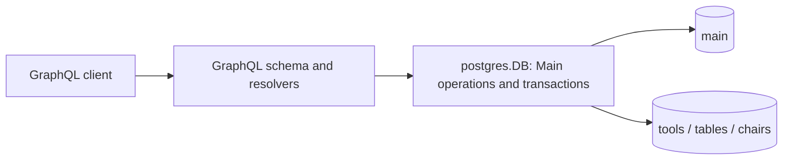

# Main + Satellite GraphQL API

Go-сервис с PostgreSQL: один `Main` владеет ровно одним спутником `Tool`, `Table` или `Chair`. Создание, чтение, изменение и мягкое удаление доступны через `http://localhost:8080/graphql`. Спутник возвращается как GraphQL union и изменяется только вместе с владельцем.

Репозиторий: [EgorKo25/main-satellite-graphql-api](https://github.com/EgorKo25/main-satellite-graphql-api).

Правила разработки и ревью собраны в [AGENTS.md](AGENTS.md): Go code style, PR workflow, SemVer, glab и договорённости проекта. Установка локальных skills на другом компьютере для их использования не требуется.

## Быстрый запуск в Docker

Нужны Docker Engine / Docker Desktop с Linux-контейнерами и Docker Compose v2. Go на хосте для этого способа не требуется.

```sh
git clone https://github.com/EgorKo25/main-satellite-graphql-api.git
cd main-satellite-graphql-api
docker compose up --build -d
docker compose ps -a
docker compose logs migrate api
```

Эти же команды работают в PowerShell. Настройки уже заполнены: Compose монтирует `config.compose.yaml` с адресом БД `db:5432` в `/config/config.yaml`. Переменные окружения для настройки приложения не нужны.

Compose ждёт готовности PostgreSQL, запускает отдельный контейнер миграций, затем запускает API только после успешного завершения миграций. Повторный `up` миграций безопасен: применённые версии учитывает Goose. Такой порядок задаётся через [`depends_on` и условия готовности](https://docs.docker.com/compose/how-tos/startup-order/).

Проверка работающего API:

```sh
curl http://localhost:8080/graphql -H "Content-Type: application/json" --data '{"query":"query { main { id title } }"}'
```

В PowerShell:

```powershell
$body = @{ query = 'query { main { id title } }' } | ConvertTo-Json
Invoke-RestMethod -Uri http://localhost:8080/graphql -Method Post -ContentType 'application/json' -Body $body
```

На новой БД результат — `{"data":{"main":[]}}`. Встроенного браузерного редактора запросов нет; можно использовать любой GraphQL-клиент с этим URL. Introspection включена.

Остановка сохраняет данные в именованном томе `postgres-data`:

```sh
docker compose down
```

Пароль `graphql_dev` в примерах — открытое учебное значение. API и PostgreSQL публикуют порты только на `127.0.0.1`. Настройки API находятся в `config.compose.yaml`; параметры контейнера PostgreSQL и аргументы goose — в `compose.yaml`. При смене учётных данных обновите оба YAML-файла. Если том уже содержит БД, измените также пользователя/пароль в самой PostgreSQL: `POSTGRES_*` применяется только при первичной инициализации. Реальные секреты храните в локальных файлах вне Git.

## Локальный запуск Go

Нужен Go 1.26.8 или новее. Для `-race` нужен поддерживаемый C-компилятор; Docker-способ тестирования уже содержит необходимые инструменты. Зависимости закреплены в `go.mod` и `go.sum`: gqlgen `v0.17.95`, pgx `v5.11.0`, goose `v3.28.0`; образы сборки и БД — `golang:1.26.8-bookworm` и `postgres:17.9-bookworm`.

Создайте локальный YAML и запустите только БД:

```sh
mkdir -p config
cp config.example.yaml config/config.yaml
docker compose up -d --wait db
```

Для миграций используется официальный goose CLI, закреплённый на `v3.28.0`, в контейнере `migrate`.

Bash / zsh:

```sh
docker compose run --build --rm migrate up
go run ./cmd/api
```

PowerShell:

```powershell
New-Item -ItemType Directory -Path config -Force | Out-Null
Copy-Item config.example.yaml config/config.yaml
docker compose up -d --wait db
docker compose run --build --rm migrate up
go run ./cmd/api
```

Go-процесс читает `./config/config.yaml` относительно текущего каталога. Загрузчик не использует `DATABASE_URL`, `CONFIG_PATH` и другие env overrides приложения. Локальный пример содержит адрес `localhost:5432`, базу `graphql`, пользователя `graphql` и пароль `graphql_dev`. При смене опубликованного порта PostgreSQL обновите `database.url`. Для одновременного запуска контейнерного и локального API измените в локальном `config/config.yaml` поле `http.addr` на `"0.0.0.0:8081"`.

Сборка бинарного файла:

```sh
go build -o bin/api ./cmd/api
```

Для Windows можно выбрать имя `bin/api.exe`. В Docker-образе находятся `/api`, официальный `/goose` и SQL-файлы `/migrations`. Контейнер миграций запускается из `/migrations` с `-dir .`; приложение использует `/config/config.yaml`. Compose монтирует выбранный YAML только для чтения. Образ запускается от UID/GID `65532:65532` и не требует shell во время работы. Обработчиков SIGINT/SIGTERM в приложении нет: эти сигналы завершают процесс сразу, без ожидания активных запросов и выполнения defer.

### Конфигурация

Конфигурация приложения — вложенный YAML. В пакете `main` объявлена `var configPath = "./config/config.yaml"`; там же создаётся `fs := afero.NewOsFs()`. `config.Load(fs, configPath)` читает файл через переданную файловую систему и возвращает проверенный `*config.App`. Этот же экземпляр FS передаётся в `logger.Initialize(fs, cfg.Logger)` для файловых выходов. `App` встраивает `Database`, `HTTP` и `Logger`; YAML сохраняет отдельные вложенные разделы. Процесс хранит конфигурацию в локальной переменной `cfg`, передаёт `cfg.Database` конструктору БД и `cfg.HTTP` конструктору сервера. Глобального изменяемого объекта конфигурации и геттеров нет.

Заполненные примеры остаются в корне проекта: [config.example.yaml](config.example.yaml) для запуска на хосте и [config.compose.yaml](config.compose.yaml) для Compose. Загрузчик отклоняет неизвестные поля и значения, не прошедшие `go-playground/validator/v10`. Загрузка и проверка завершаются до открытия HTTP-сервера. Локальный `config/config.yaml` исключён из Git.

| Поле YAML | Значение в примере | Назначение |
| --- | --- | --- |
| `database.url` | `postgres://localhost:5432/graphql?sslmode=disable` | Адрес PostgreSQL и имя БД; в Compose используется хост `db` |
| `database.user` | `graphql` | Пользователь PostgreSQL |
| `database.password` | `graphql_dev` | Пароль PostgreSQL, передаётся драйверу отдельно от URL |
| `database.connect_timeout` | `5s` | Подключение и проверка доступности БД при старте |
| `database.max_conns` | `10` | Максимум соединений пула |
| `database.min_conns` | `0` | Минимум соединений, не выше `max_conns` |
| `http.addr` | `0.0.0.0:8080` | Адрес HTTP-сервера |
| `http.request_timeout` | `10s` | Общий контекст запроса, включая операции БД |
| `http.read_header_timeout` | `5s` | Чтение HTTP-заголовков |
| `http.read_timeout` | `10s` | Чтение HTTP-запроса |
| `http.write_timeout` | `15s` | Запись HTTP-ответа |
| `http.idle_timeout` | `1m` | Ожидание следующего запроса в соединении |
| `http.shutdown_timeout` | `15s` | Завершение активных запросов при отмене контекста Server.Serve |
| `logger.cores[].level` | `info` | Минимальный уровень ядра: `debug`, `info`, `warn`, `error`, `dpanic`, `panic`, `fatal` |
| `logger.cores[].encoding` | `json` | Формат записи: `json` или `console` |
| `logger.cores[].output` | `stdout` | Вывод: `stdout`, `stderr` или `file` |
| `logger.cores[].path` | не задан | Путь файла, обязателен для `output: file` |
| `logger.cores[].time_format` | `utc` | Время в UTC/RFC3339Nano или `local`/ISO8601 |

HTTP-настройки имеют эти же defaults при отсутствии полей. Они описаны тегами `default` и заполняются через [creasty/defaults](https://github.com/creasty/defaults) до декодирования YAML. Затем значения из файла заменяют defaults, после чего запускается validator. Явно заданный нулевой timeout отклоняется; повторной подстановки defaults после чтения нет. Параметры БД задаются YAML, а `database.min_conns: 0` допустим. Интервалы записываются как Go duration: `500ms`, `5s`, `1m`.

Логгер использует адаптер над `go.uber.org/zap`. `main` один раз инициализирует общий логгер через `logger.Initialize` до запуска обработки запросов; компоненты получают именованный логгер через `logger.Get(name)`. Каждое ядро имеет собственный порог, формат и получатель; `zapcore.NewTee` направляет запись во все подходящие ядра. При отсутствии секции используется одно ядро `info/json/stdout/utc`, заданное тегами `default`. Явный список `cores` полностью заменяет стандартный: он должен быть непустым и содержать все обязательные параметры каждого ядра. Параметры проверяются валидатором.

Например, консоль для разработки и отдельный файл ошибок:

```yaml
logger:
  cores:
    - level: debug
      encoding: console
      output: stdout
      time_format: local
    - level: error
      encoding: json
      output: file
      path: logs/errors.log
      time_format: utc
```

Ошибка попадёт в оба ядра. Каталог файла создаётся при инициализации; существующий файл открывается для дозаписи. Процессу нужны права записи, а в контейнере — доступный для записи mount. `Close` синхронизирует и закрывает все файловые получатели, объединяя ошибки Sync и Close. Повторное закрытие, в том числе через именованный логгер, возвращает сохранённый результат. Ошибки записи zap выводит в stderr; они не накапливаются для последующего Sync. В `main` закрытие логгера стоит в defer с явным игнорированием ошибки. Ошибка чтения конфига вызывает `panic`; при ошибках подключения к БД и работы HTTP-сервера `main` записывает ошибку и возвращается, выполняя defer. По принятому решению такой возврат имеет код 0. Потеря последних записей при завершении процесса сигналом принята как допустимое ограничение.

Compose передаёт goose драйвер и строку подключения аргументами команды. `POSTGRES_USER`, `POSTGRES_PASSWORD` и `POSTGRES_DB` заданы литералами в `compose.yaml`: это настройки стандартного образа PostgreSQL. API их не читает. Размер HTTP body ограничен 1 MiB, сложность GraphQL-запроса — 10000; стоимость списка учитывает `limit`.

## Контракт API

Полная исполняемая схема: [internal/graph/schema.graphqls](internal/graph/schema.graphqls).

```graphql
type Query {
  main(id: ID, limit: Int! = 20, offset: Int! = 0): [Main!]!
}

type Mutation {
  main(input: MainMutationInput!): MainMutationPayload
}

input MainMutationInput @oneOf {
  create: MainCreateInput
  update: MainUpdateInput
  delete: MainDeleteInput
}

union Satellite = Tool | Table | Chair

enum ChairType {
  abc
  cde
}
```

`Query.main` возвращает список активных записей по возрастанию `id`. Без `id` действуют `limit=20`, `offset=0`; допустимы `1 <= limit <= 100` и `offset >= 0`. Фильтр `id` также возвращает список; для неизвестной или удалённой записи это `[]`. Пагинация применяется и при фильтре по ID.

ID — положительный PostgreSQL `BIGINT`, максимум `9223372036854775807`. В ответе GraphQL ID всегда строка. В variables рекомендуется строка, чтобы JavaScript не потерял точность больших чисел. Ноль, отрицательные значения, знак `+`, дроби, произвольный текст и переполнение отклоняются. Времена представлены строками RFC 3339 в UTC; SQL `update_at` отображается в GraphQL как `updatedAt`.

`MainMutationPayload` содержит `main` и `deletedId`. Создание и изменение возвращают `main` с актуальным спутником и `deletedId: null`. Удаление возвращает `main: null` и строковый `deletedId`.

### OneOf: ровно один переданный ключ

`MainMutationInput`, `SatelliteCreateInput` и `SatelliteUpdateInput` используют `@oneOf`: должен быть передан ровно один ключ, и его значение должно быть ненулевым. Считается наличие ключа, включая ключи со значением `null`. Правило проверяется и для литералов в GraphQL-документе, и для JSON variables. Это семантика [OneOf Input Objects из спецификации GraphQL](https://spec.graphql.org/September2025/#sec-OneOf-Input-Objects).

| Вход | Результат |
| --- | --- |
| `{"delete":{"id":"42"}}` | Корректная форма |
| `{}` | Ошибка: нет выбранной операции |
| `{"create":null}` | Ошибка: выбранное значение `null` |
| `{"delete":{"id":"42"},"create":null}` | Ошибка: переданы два ключа |
| `{"tool":{},"table":{}}` внутри `satellite` | Ошибка: переданы два вида спутника |

Разновидность спутника выбирается при создании и затем не меняется. Попытка обновить `table` у владельца `tool` приводит к `SATELLITE_TYPE_MISMATCH`. При этом поле `Chair.type` разрешено изменять между `abc` и `cde`.

### Частичное изменение и `null`

Отсутствующее поле сохраняет значение. Явный `null` очищает только nullable-описание спутника. Для `title` и контейнера `satellite` используется `graphql.Omittable`; внутри map спутника отсутствие ключа отличается от ключа с nil-значением, в том числе типизированным nil после разбора gqlgen. Доменные объекты не содержат patch-состояний. См. [подход gqlgen к частичным обновлениям](https://gqlgen.com/reference/changesets/).

| Поле в update | Не передано | `null` | Значение |
| --- | --- | --- | --- |
| `title` | Сохранить | Ошибка | Заменить; `""` допустима |
| `satellite` | Сохранить | Ошибка | Изменить существующий спутник |
| `description1/2/3` | Сохранить | Очистить до SQL `NULL` | Заменить; `""` допустима |
| `chair.type` | Сохранить | Ошибка | `abc` или `cde` |

Update только с `id` отклоняется. Пустой patch спутника, например `{"tool":{}}`, тоже отклоняется, даже если одновременно передан новый `title`. При создании пустое описание можно не указывать или передать как `null`; для `Chair` всегда нужен `type`.

### Ошибки и удаление

Ошибки возвращаются в стандартном GraphQL-массиве `errors`. Для ошибок приложения используется `errors[].extensions.code`:

| Код | Ситуация |
| --- | --- |
| `BAD_USER_INPUT` | Неверный ID, пагинация, пустой patch, запрещённый `null` |
| `NOT_FOUND` | Изменение неизвестного/удалённого `Main` или удаление неизвестного |
| `ALREADY_DELETED` | Повторное удаление существующего удалённого `Main` |
| `SATELLITE_TYPE_MISMATCH` | Попытка заменить разновидность спутника |
| `INTERNAL_SERVER_ERROR` | Внутренняя ошибка; клиенту не выдаются SQL и детали инфраструктуры |

Ошибки синтаксиса и типизации отклоняются GraphQL-движком. Входная граница дополнительно проверяет OneOf в variables, неизвестные поля и точное написание enum до выполнения операций БД. Ошибки этих проверок имеют код `BAD_USER_INPUT`; стандартные ошибки parsing/validation могут иметь собственные сообщения и коды библиотеки. Проверяйте `errors`, даже если HTTP-статус равен 200.

Удаление мягкое: `deleted_at` владельца и спутника устанавливается в одно время в одной транзакции. Записи остаются в БД; активное чтение их скрывает. Восстановление не предусмотрено. Повторное удаление не обновляет timestamps и возвращает `ALREADY_DELETED`.

Время операции берётся один раз через `time.Now().UTC()` в приложении и передаётся обеим записям. Для update/delete время берётся после блокировки Main; отдельных запросов текущего времени к БД нет.

## Примеры запросов с variables

Для всех мутаций ниже используется один документ. В клиенте вставьте его в Query и соответствующий JSON — в Variables. ID в примерах условные: после создания подставьте фактически полученный `main.id`.

```graphql
mutation ChangeMain($input: MainMutationInput!) {
  main(input: $input) {
    main {
      id
      title
      createdAt
      updatedAt
      deletedAt
      satellite {
        __typename
        ... on Tool { id description1 createdAt updatedAt deletedAt }
        ... on Table { id description2 createdAt updatedAt deletedAt }
        ... on Chair { id description3 type createdAt updatedAt deletedAt }
      }
    }
    deletedId
  }
}
```

`Satellite` — union: поля конкретного спутника запрашиваются через inline fragments `... on Tool`, `... on Table`, `... on Chair`; `__typename` показывает выбранный тип.

### Создать каждый вид спутника

Tool:

```json
{"input":{"create":{"title":"Молоток","satellite":{"tool":{"description1":"Для мастерской"}}}}}
```

Table:

```json
{"input":{"create":{"title":"Рабочий стол","satellite":{"table":{"description2":"Дубовая столешница"}}}}}
```

Chair:

```json
{"input":{"create":{"title":"Офисное кресло","satellite":{"chair":{"description3":"С подлокотниками","type":"abc"}}}}}
```

Tool без описания, с допустимым пустым заголовком:

```json
{"input":{"create":{"title":"","satellite":{"tool":{}}}}}
```

### Прочитать список и запись по ID

```graphql
query ReadMain($id: ID, $limit: Int! = 20, $offset: Int! = 0) {
  main(id: $id, limit: $limit, offset: $offset) {
    id
    title
    createdAt
    updatedAt
    deletedAt
    satellite {
      __typename
      ... on Tool { id description1 }
      ... on Table { id description2 }
      ... on Chair { id description3 type }
    }
  }
}
```

Первая страница:

```json
{"limit":20,"offset":0}
```

Следующая страница:

```json
{"limit":20,"offset":20}
```

По ID:

```json
{"id":"1"}
```

Для отсутствующего или мягко удалённого ID ожидается `{"data":{"main":[]}}`.

### Обновить `title`

Спутник сохраняется:

```json
{"input":{"update":{"id":"1","title":"Новый заголовок"}}}
```

### Обновить поля спутника

Tool:

```json
{"input":{"update":{"id":"1","satellite":{"tool":{"description1":"Новое описание инструмента"}}}}}
```

Table:

```json
{"input":{"update":{"id":"2","satellite":{"table":{"description2":"Новое описание стола"}}}}}
```

Chair, включая допустимую смену `type`:

```json
{"input":{"update":{"id":"3","satellite":{"chair":{"description3":"Новое описание кресла","type":"cde"}}}}}
```

Заголовок и спутник в одной транзакции:

```json
{"input":{"update":{"id":"1","title":"Новый молоток","satellite":{"tool":{"description1":"Обновлено вместе с владельцем"}}}}}
```

### Очистить описание явным `null`

Tool:

```json
{"input":{"update":{"id":"1","satellite":{"tool":{"description1":null}}}}}
```

Table:

```json
{"input":{"update":{"id":"2","satellite":{"table":{"description2":null}}}}}
```

Chair, сохранив его `type`:

```json
{"input":{"update":{"id":"3","satellite":{"chair":{"description3":null}}}}}
```

Ответ содержит соответствующее описание `null`. Передача `""` вместо `null` сохранит пустую строку.

### Мягко удалить и повторить удаление

```json
{"input":{"delete":{"id":"1"}}}
```

Первый ответ:

```json
{"data":{"main":{"main":null,"deletedId":"1"}}}
```

Повторите те же variables: результат содержит ошибку `ALREADY_DELETED`, а `data.main` равен `null`. Чтение этого ID возвращает `[]`; его изменение приводит к `NOT_FOUND`.

### Ошибочные операции

Каждый JSON — отдельный набор variables к `ChangeMain`:

```json
{"input":{"create":{"title":"Некорректный выбор","satellite":{"tool":{},"table":{}}}}}
```

Два вида спутника: ошибка OneOf.

```json
{"input":{"delete":{"id":"2"},"create":null}}
```

Две операции, включая явно переданный `null`: ошибка OneOf.

```json
{"input":{"update":{"id":"3","title":null}}}
```

Запрещённый `null`: `BAD_USER_INPUT`.

```json
{"input":{"update":{"id":"3"}}}
```

Пустое изменение: `BAD_USER_INPUT`.

```json
{"input":{"update":{"id":"2","satellite":{"table":{}}}}}
```

Пустой patch спутника: `BAD_USER_INPUT`.

```json
{"input":{"update":{"id":"2","satellite":{"chair":{"type":"abc"}}}}}
```

Если `2` владеет `Table`, результат — `SATELLITE_TYPE_MISMATCH`.

```json
{"input":{"delete":{"id":"0"}}}
```

Неверный ID: `BAD_USER_INPUT`.

```json
{"input":{"update":{"id":"9223372036854775807","title":"Не существует"}}}
```

Для неизвестного ID: `NOT_FOUND`.

```json
{"input":{"create":{"title":"Кресло","satellite":{"chair":{"type":"unknown"}}}}}
```

Неверный enum отклоняется GraphQL-движком. Для документа `ReadMain` variables `{"limit":0}` или `{"offset":-1}` дают `BAD_USER_INPUT`.

Пример полного HTTP body, который можно сохранить как UTF-8 `request.json`:

```json
{
  "query":"mutation ChangeMain($input: MainMutationInput!) { main(input: $input) { main { id title satellite { __typename ... on Tool { description1 } } } deletedId } }",
  "variables":{"input":{"create":{"title":"Молоток","satellite":{"tool":{"description1":"Для мастерской"}}}}}
}
```

```sh
curl http://localhost:8080/graphql -H "Content-Type: application/json" --data-binary @request.json
```

В PowerShell для последней команды используйте `curl.exe`, чтобы вызвать curl, а не alias PowerShell.

## Хранение и транзакции

Схема БД находится в [migrations/00001_main_satellites.sql](migrations/00001_main_satellites.sql).

| Таблица | Основные поля |
| --- | --- |
| `main` | `id`, `title`, `sub_id`, `sub_obj`, `created_at`, `update_at`, `deleted_at` |
| `tools` | `id`, `main_id`, `description1`, `created_at`, `update_at`, `deleted_at` |
| `tables` | `id`, `main_id`, `description2`, `created_at`, `update_at`, `deleted_at` |
| `chairs` | `id`, `main_id`, `description3`, `type`, `created_at`, `update_at`, `deleted_at` |

ID — `BIGINT` с identity; даты — `TIMESTAMPTZ`; `type` — PostgreSQL enum `chair_type ('abc', 'cde')`. Все колонки, кроме описаний и `deleted_at`, обязательны. `sub_obj` ограничен значениями `tools`, `tables`, `chairs`. `satellite.main_id` имеет `UNIQUE` и внешний ключ на `main.id`; активное чтение использует частичный индекс по `main.id`.


```mermaid
flowchart LR
    Client[GraphQL client] --> Graph[GraphQL schema and resolvers]
    Graph --> Database[postgres.DB: Main operations and transactions]
    Database --> Main[(main)]
    Database --> Satellites[(tools / tables / chairs)]
```

`main.sub_obj + main.sub_id` указывают на спутник; его `main_id` указывает обратно. После проверки OneOf GraphQL-резолвер вызывает общие `DB.Create`, `DB.Update`, `DB.Delete`. Входы спутников разобраны gqlgen в maps, SQL собирается через [Squirrel](https://github.com/Masterminds/squirrel) `v1.5.4` и его `SetMap`. Единственное соответствие имён — `tool → tools`, `table → tables`, `chair → chairs`; отдельного реестра колонок и SQL-обработчиков по видам нет. Для soft delete таблица определяется по виду из заблокированного Main. Пользовательские значения передаются SQL-параметрами; имена таблиц берутся только из фиксированного соответствия.

Полиморфная ссылка `main.sub_id` не представлена одним внешним ключом на три таблицы. Целостность пары и единственность вида обеспечиваются транзакциями приложения; `UNIQUE(main_id)` действует внутри каждой таблицы спутников. Произвольная запись SQL в обход операций приложения может нарушить общую полиморфную связь — это граница данного решения.

Объект `postgres.DB` владеет пулом соединений. Каждый метод записи создаёт локальную транзакцию; её не передают наружу и не хранят в общем DB. Создание владельца и спутника атомарно: сначала выделяется ID спутника из sequence, затем вставляются Main с заполненным `sub_id` и спутник с заполненным `main_id`. Update/delete блокируют Main через `SELECT FOR UPDATE`; после получения блокировки проверяются состояние удаления и допустимость выбранной операции. Последующий `UPDATE` спутника блокирует его строку. Все SQL-запросы одной операции выполняются через ту же транзакцию. Результат читается до commit и возвращается только после успешного commit; ошибки записи и commit не становятся успешным ответом. Отложенный rollback размещён непосредственно в каждой операции и использует контекст запроса. При ошибке rollback pgx закрывает соединение, поэтому отменённый запрос не оставляет незавершённую транзакцию в пуле; причина ошибки логируется. Конкурентные операции над одним владельцем последовательно получают блокировку, поэтому не создают частично обновлённую пару. Пропуски identity после rollback допустимы.

Любой корректный update обновляет `Main.updatedAt`. `satellite.updatedAt` обновляется только при передаче patch спутника; изменение одного `title` сохраняет время спутника. При совместном изменении и при удалении используется одно значение времени для обеих записей. `createdAt` не меняется.

Чтение страницы загружает владельцев вместе со спутниками одним SQL-запросом с соединениями. Резолвер union читает уже загруженные данные, поэтому число SQL-запросов не растёт с количеством `Main` на странице.

### Структура проекта

```text
cmd/api/                  сборка зависимостей и закрытие ресурсов
internal/server/          HTTP-сервер, маршруты, таймауты и graceful shutdown
internal/config/          типизированный YAML и проверка настроек
internal/logger/          общий логгер, именованные логгеры и адаптер zap
internal/domain/          Main, Satellite, Tool, Table и Chair
internal/postgres/        пул, общие операции записи, транзакции, SQL и чтение
internal/graph/           SDL, выбор операции, проверка GraphQL-входа и HTTP-handler
internal/graph/scalar/    ID с представлением строкой и Time в UTC
internal/graph/model/     сгенерированные транспортные контейнеры OneOf и payload
internal/graph/generated/ сгенерированный исполняемый GraphQL-код
migrations/               обычные SQL-файлы goose up/down
config.example.yaml       пример конфигурации без секретов
config.compose.yaml       заполненная конфигурация API для Compose
```

`main` собирает конфигурацию, логгер, БД, GraphQL-handler и `server.Server`. Конструктор `server.New(cfg.HTTP, handler)` настраивает `/graphql` и HTTP-таймауты; `Server.Serve(ctx)` запускает сервер и выполняет graceful shutdown при отмене контекста. `main` передаёт `context.Background()`, поэтому отмены от сигналов нет. Закрытие БД и логгера зарегистрировано через defer сразу после успешной инициализации каждого ресурса.

`Satellite` содержит общие идентификаторы и timestamps и встроен в `Tool`, `Table`, `Chair`. У `Chair` находятся только его собственные `description3` и `type`. PostgreSQL возвращает содержимое спутника в `Main.SatelliteData` как `json.RawMessage`. Resolver `Main.satellite` выбирает фабрику Tool/Table/Chair по `SubObj` и декодирует JSON непосредственно в конкретный объект `domain.SubObject`; JSON-теги связывают имена SQL-колонок с полями структуры. Других преобразований между слоями нет. Каждый вызов resolver создаёт собственный объект, в том числе при параллельном выполнении aliases.

В [gqlgen.yml](gqlgen.yml) выходные Main/Tool/Table/Chair связаны напрямую с доменными сущностями. Шесть входов создания/обновления спутников и два их OneOf-контейнера связаны с `map[string]interface{}`; gqlgen проверяет SDL и приводит значения, включая enum и nullable-указатели. Входы Main остаются сгенерированными транспортными структурами. Отдельной цепочки mapper/DTO между слоями нет. `graphql.Omittable` для полей Main сохраняет три состояния поля.

Общие write-методы PostgreSQL получают maps после GraphQL-проверки; они не являются самостоятельным API для произвольных JSON-объектов. Перечень разрешённых клиенту колонок определяется SDL, и имена полей спутника должны совпадать с SQL-колонками. ID, связи и timestamps добавляет только DB, не изменяя входную map. В DB остаются проверки пустого patch, запрещённого null и состояния связки. Экземпляр validator создаётся вместе с DB и переиспользуется для проверки пагинации.

Адаптеры `internal/graph/scalar` задают ограничения API поверх gqlgen: ID принимает только положительный BIGINT и возвращает `BAD_USER_INPUT` для неверного формата или диапазона; Time приводит часовой пояс к UTC. Встроенный Time gqlgen форматирует исходный часовой пояс, поэтому прямая замена изменила бы поведение сериализации.

`samber/lo` используется для преобразования атрибутов логгера (`Map`), поиска таблицы в фиксированном соответствии (`FindKey`) и подготовки ожидаемых данных в тестах (`Associate`, `KeyBy`). Копирование maps остаётся в стандартной библиотеке; проверки ошибок и освобождение ресурсов выполняются явно.

Create и update получают записанные значения через `RETURNING`: Main читается готовым коллектором pgx по именам колонок, спутник — через `row_to_json` уже выбранной таблицы. Для title-only update читается только эта таблица спутника. После записи нет дополнительного чтения всего агрегата; delete проверяет результаты обеих операций UPDATE. Перед изменением существующего Main проверяется единственность его спутника через EXISTS по индексам main_id. Вся операция Update, включая блокировку, запись и commit, находится в одном методе DB.

List сначала выбирает страницу Main, затем через `LATERAL UNION ALL` возвращает JSON выбранной строки спутника и признак согласованности связи. Отсутствующая, лишняя или несогласованная связь вызывает ошибку даже при запросе только полей Main. Чтение выполняется одной SQL-командой без N+1 и перечисления полей всех разновидностей в Go. JSON используется только как проекция результата: данные остаются в четырёх реляционных таблицах, JSONB-хранилища нет.

Конкретный объект декодируется только при запросе `satellite`. BIGINT читается непосредственно в `int64`, без промежуточного `float64`; SQL NULL и пустая строка сохраняются. Для Main pgx декодирует timestamps в UTC; для спутника JSON разбирает `time.Time`, а GraphQL scalar Time приводит ответ к UTC. Кодирование JSON на стороне PostgreSQL и декодирование в Go добавляют работу; этот выбор уменьшает ручной маппинг. Локальное декодирование измерено ниже; ускорение всего API не измерялось.

Бизнес-проверки текущего состояния и границы транзакций находятся в операциях `postgres.DB`; построение SQL с аргументами расположено рядом с вызовом pgx. Отдельного слоя из методов, только перенаправляющих вызовы в DB, нет. Сателлиты по-прежнему доступны только через Main.

### Выбор фабрики и JSON-декодера

Я разделил выбор типа и разбор данных на два эксперимента. На моём стенде создание объекта через таблицу фабрик занимает около 52 нс, через обычный switch — 42 нс, через `lo.Switch` — 43 нс. Во всех вариантах одна аллокация для возвращаемого объекта, в среднем 85 B/op при чередовании трёх типов. Поэтому текущую таблицу фабрик я сохраняю: замена нескольких сравнений не устраняет основную стоимость декодирования.

Эквивалентный вариант с lo выглядит так; `CaseF` создаёт только выбранный объект. При `Case(..., new(...))` аргументы всех веток вычислялись бы до выбора:

```go
func factoryLO(kind domain.Kind) domain.SubObject {
    return lo.Switch[domain.Kind, domain.SubObject](kind).
        CaseF(domain.Tools, func() domain.SubObject { return new(domain.Tool) }).
        CaseF(domain.Tables, func() domain.SubObject { return new(domain.Table) }).
        CaseF(domain.Chairs, func() domain.SubObject { return new(domain.Chair) }).
        Default(nil)
}
```

Для дальнейшей оптимизации JSON-пути я выбираю **easyjson**: на проверенных данных он быстрее стандартного декодера и обоих измеренных вариантов fastjson, при этом маппинг генерируется из типов и тегов. С fastjson мне пришлось вручную читать поля, проверять ошибки преобразований, копировать строки и разбирать timestamps. Повторно используемый Parser требует отдельного владельца: его нельзя одновременно использовать из нескольких goroutines; результаты должны сохраняться после следующего Parse. У нового Parser заметно выше расход памяти.

В текущем API остаются `encoding/json` и таблица фабрик. Замена рабочего декодера — отдельное изменение; приведённые измерения обосновывают выбор кандидата, но не подтверждают выигрыш HTTP API. Easyjson/fastjson подключены для сравнительного пакета и не входят в дерево импортов `cmd/api`. Генерация easyjson выполняется для отдельных benchmark-типов на основе доменных, с `-no_std_marshalers`: стандартный вариант не может незаметно вызвать сгенерированный UnmarshalJSON.

Медианы 10 запусков, Go 1.26.8, Windows/amd64, Intel i7-8700K, `-cpu=1`, `-benchtime=200ms`, 08.10.2026. Операция — декодирование всей страницы с созданием и сохранением результатов:

| Декодер | 1 Chair, описание 32 B | 20 объектов, 32 B | 100 объектов, 32 B | B/op, 100 × 32 B | allocs/op, 100 × 32 B | 100 объектов, 4 КиБ |
|---|---:|---:|---:|---:|---:|---:|
| encoding/json | 2,911 мкс | 55,57 мкс | 277,11 мкс | 41 808 | 935 | 2,226 мс |
| easyjson | 0,819 мкс | 14,89 мкс | 73,62 мкс | 15 244 | 335 | 161,2 мкс |
| fastjson, повторное использование Parser | 0,942 мкс | 17,29 мкс | 86,73 мкс | 15 244 | 335 | 174,3 мкс |
| fastjson, новый Parser | 1,825 мкс | 33,32 мкс | 170,08 мкс | 198 989 | 1 235 | 322,4 мкс |
| pgx, типизированный collector | 1,567 мкс | 25,61 мкс | 126,59 мкс | 47 020 | 1 369 | 195,1 мкс |

Числа B/op округлены до целых байтов средствами Go benchmark. Точные результаты, интервалы и сравнения benchstat: [исходные замеры](docs/benchmarks/windows-amd64.txt), [сводка](docs/benchmarks/windows-amd64-summary.txt), [сравнение декодеров](docs/benchmarks/windows-amd64-comparison.txt).

Я не переношу эти коэффициенты на весь сервис. Здесь нет SQL, сети, ожидания пула/блокировок, PostgreSQL `row_to_json` и формирования GraphQL-ответа. `pgx_binary` — контроль с заранее подготовленными значениями и настоящими pgx codecs/collector, но искусственной строкой, а не запросом к PostgreSQL. Для него смоделирован SQL-алиас `update_at AS updated_at`; enum представлен текстовым значением. В обоих путях заранее подготовленные входы не входят в таймер. Сравнение не доказывает, что JSON-запрос быстрее обычного SQL.

Для страниц 20/100 чередуются Chair, Tool, Table. Описания в замере — ASCII-строки длиной 32/4096 байт; один объект — Chair. Кеши прогреты до таймера. `fastjson_reuse` показывает последовательное использование одного Parser, без стоимости синхронизации/пула и без оценки удерживаемой им памяти. `fastjson_fresh` создаёт Parser для каждого объекта. Результат — полностью заполненные Go-объекты с собственными строками, точными int64, timestamps и nullable-полями; измерение одного Parse без маппинга не использовано.

Стоимость декодирования растёт с объёмом **выбранных** данных: количеством объектов, длиной строк и повторными запросами/aliases. Размер всей таблицы сам по себе не увеличивает число декодируемых объектов одной страницы: `limit` ограничен 100. Отдельно нужно измерять SQL-план и обработку большого offset. Для выбора оптимизации всего сервиса потребуются нагрузочный HTTP-тест, CPU/heap profiles и p95/p99.

Код эксперимента находится в [internal/graph/benchmarks](internal/graph/benchmarks). Тесты проверяют все разновидности, максимальный BIGINT, NULL/пустые/Unicode-строки, часовые пояса и микросекунды, ошибки JSON/типов/overflow/timestamps, владение строками после повторного Parse и свежие экземпляры фабрик. Отдельные бенчмарки измеряют ошибки overflow и timestamp. Это набор проверок формата SQL-проекции, а не доказательство полной эквивалентности JSON-библиотек для любых документов. CI выполняет тесты, генерацию и однократный запуск всех бенчмарков без порогов производительности.

Повторить эксперимент:

```sh
go generate ./internal/graph/benchmarks
go test ./internal/graph/benchmarks -count=1
go test ./internal/graph/benchmarks -run='^$' -bench='Benchmark(Factory|Decode)' -benchmem -benchtime=200ms -count=10 -cpu=1
```

Последняя команда также доступна как `make bench`. Для сохранения UTF-8 в Windows PowerShell:

```powershell
New-Item -ItemType Directory -Force .tmp | Out-Null
go test ./internal/graph/benchmarks -run='^$' -bench='Benchmark(Factory|Decode)' -benchmem -benchtime=200ms -count=10 -cpu=1 |
    Set-Content -Encoding utf8 .tmp/bench.txt
go run golang.org/x/perf/cmd/benchstat@v0.0.0-20260929162123-406019bb8b68 .tmp/bench.txt
```

Benchstat закреплён командой с версией отдельно от зависимостей приложения. Версии библиотек эксперимента: [easyjson v0.9.2](https://github.com/mailru/easyjson/tree/v0.9.2), [fastjson v1.6.10](https://github.com/valyala/fastjson/tree/v1.6.10), [lo v1.53.0](https://github.com/samber/lo/blob/v1.53.0/condition.go), pgx v5.11.0. Новые версии остальных зависимостей ради эксперимента не подключались.

### SQL + декодирование: проверка роста таблиц

Для сравнения полного пути чтения я добавил `BenchmarkReadPostgres` в
[internal/postgres/integration_tests/read_benchmark_test.go](internal/postgres/integration_tests/read_benchmark_test.go).
Он использует ту же Dockertest-fixture и настоящие миграции, что и интеграционные тесты.
Один PostgreSQL 17.9 запускается автоматически; для каждого набора создаётся отдельная БД.
После завершения удаляются только созданные тестом БД и контейнер.

Сравниваются четыре варианта одной операции чтения:

- `columns_scan`: SQL-колонки → ручной `rows.Scan` → `lo.Switch` → доменные объекты;
- `columns_collector`: SQL-колонки → `pgx.RowToStructByName` → `lo.Switch` → доменные объекты;
- `json_lo_easy`: `row_to_json` → `lo.Switch.CaseF` → сгенерированный easyjson → доменные объекты;
- `json_map_standard`: `row_to_json` → таблица фабрик → `encoding/json`, как в текущем API.

Оба SQL-варианта используют одинаковые фильтр, сортировку, пагинацию и `LATERAL UNION ALL`.
У каждого одна SQL-команда на страницу и проверка обязательной связи. Прямой SQL возвращает
общие поля сателлита, описание и nullable-тип кресла; JSON-вариант возвращает полную запись выбранной таблицы.
Экспериментальные проекции и декодеры находятся только в тестовых файлах; production-код не изменён.

В основных наборах **100, 500 000 и 1 000 000 строк Main** плюс столько же строк сателлитов
суммарно, поровну между Tool/Table/Chair с округлением. Это не миллион строк в каждой таблице.
Описания: 20% SQL NULL, 20% пустых строк и 60% строк из 32 ASCII-символов.
Отдельный набор из 100 объектов использует строки по 4096 символов с тем же распределением NULL/пустых значений.
Большие строки повторяющиеся и хорошо сжимаются PostgreSQL: этот случай не моделирует несжимаемые документы.
Все Main активны; сильный перекос типов и накопление soft-deleted строк здесь не моделируются.

Для каждого набора измеряются страницы по 20 и 100 объектов: первая (`OFFSET 0`) и последняя
(`OFFSET = количество Main − limit`). При 100 объектах страницы first/last с limit=100 совпадают.
Подготовка включает заполнение, `ANALYZE`, проверку количества записей и прогрев запроса.
Контейнер, миграции, заполнение и проверки результата находятся за пределами таймера.
Внутри — получение соединения из пула, SQL, передача данных, pgx, выбор типа и построение всей страницы.
Данные читаются последовательно одним клиентом; HTTP и формирование GraphQL-ответа не измеряются.

Тесты сравнивают все поля с ожидаемыми объектами и с текущим `DB.List`, проверяют пагинацию,
NULL/пустые описания и ошибки отсутствующей, лишней, удалённой или неверно связанной записи.
Бенчмарки проверяют результат до и после серии. Память и аллокации относятся к Go-процессу,
а не к PostgreSQL; ns/op — среднее время операции в одном повторе, не p95/p99.
Это прогретое чтение через Docker с tmpfs, а не испытание холодного диска или параллельной нагрузки.

Запуск при работающем Docker, без ручного создания БД:

```sh
go test -tags=integration ./internal/postgres/integration_tests -run='TestReadPaths' -count=1
go test -tags=integration ./internal/postgres/integration_tests -run='^$' -bench=BenchmarkReadPostgres -benchmem -benchtime=200ms -count=10 -cpu=1 -timeout=15m
```

Вторая команда доступна как `make bench-postgres`; CI выполняет её отдельно от race detector.
Для короткой проверки можно заменить `-count=10 -benchtime=200ms` на `-count=1 -benchtime=1x`.
Даже короткая проверка создаёт большие наборы данных: Docker должен располагать свободной памятью для tmpfs.

Локальные результаты, 08.10.2026, Go 1.26.8, Windows/amd64, i7-8700K, Docker Desktop:
[все 640 измерений](docs/benchmarks/windows-postgres.txt) и
[сравнение benchstat](docs/benchmarks/windows-postgres-comparison.txt).
Для первой страницы из 20 объектов с описаниями 32 B:

| Main в БД | Scan + lo | Collector + lo | row_to_json + lo + easyjson | row_to_json + map + encoding/json |
|---:|---:|---:|---:|---:|
| 100 | 0,575 мс | 0,591 мс | 0,680 мс | 0,890 мс |
| 500 000 | 0,628 мс | 0,642 мс | 0,703 мс | 0,774 мс |
| 1 000 000 | 0,624 мс | 0,644 мс | 0,700 мс | 0,785 мс |

На миллионе Main последняя страница из 20 объектов (`OFFSET 999980`) занимает 82,14 / 83,69 /
82,19 / 81,70 мс соответственно. Размер возвращаемой страницы прежний, но глубокая пагинация
существенно дороже во всех вариантах. Я не приписываю этот рост JSON-декодеру.

В части локальных замеров интервалы очень широкие, до 155%: например, для 500 000 Main
нестабильны результаты страницы из 100 объектов и последней страницы из 20 объектов.
Я сохраняю их без исключения неудобных повторов и не использую для точного ранжирования.
Повторы выполняются группами по варианту; внешняя нагрузка и дрейф стенда могут влиять на сравнение.
Статистическая значимость сама по себе не устраняет эти ограничения.

Для первой страницы из 100 объектов на миллионе Main память Go составляет:

| Путь | КиБ/op | allocs/op |
|---|---:|---:|
| Scan + lo | 89,57 | 841 |
| Collector + lo | 103,64 | 941 |
| row_to_json + lo + easyjson | 81,13 | 1098 |
| row_to_json + map + encoding/json | 106,69 | 1698 |

У easyjson меньше выделенных байтов, чем у измеренного Scan, но больше отдельных аллокаций.
Для длинных описаний результат другой: на странице из 100 объектов (60 строк по 4 КиБ)
Scan выделяет 327,7 КиБ, easyjson — 592,7 КиБ. В JSON-пути дополнительно материализуется текстовая проекция.
Эти цифры характеризуют конкретные реализации, а не нижнюю границу затрат любого SQL-сканера.

### Миграции

Используется официальный [goose CLI](https://github.com/pressly/goose) `v3.28.0`, без собственного runner и без `embed`. Goose читает SQL-файлы из каталога `migrations` и ведёт версии в служебной таблице БД. Команды запускаются из этого каталога с `-dir .`; `-env=none` отключает неявное чтение dotenv самим goose. Версия CLI закреплена в Dockerfile, Makefile использует тот же контейнер миграций.

API сам миграции не запускает. Обычный Compose сначала выполняет `up` в отдельном контейнере, затем запускает API. Повторный запуск не создаёт таблицы заново и не удаляет данные.

Для локального запуска в окружении с Make доступны:

```sh
make migrate-status
make migrate-up
```

Эти команды запускают контейнер `migrate` с подключением из `compose.yaml`. `down` удаляет доменную схему вместе с данными: перед проверкой отката укажите в отдельном Compose-файле заранее созданную одноразовую БД.

```sh
make migrate-down
make migrate-up
```

Без Make используйте `docker compose run --rm migrate status` или `docker compose run --rm migrate up`. Интеграционная проверка `down/up` выполняется только внутри собственной временной БД; обычный запуск не откатывает основную схему.

## Тестирование

Unit-тесты и статические проверки:

```sh
go test -count=1 ./...
go vet ./...
go build ./...
golangci-lint run --build-tags=integration
```

Используйте golangci-lint второй версии, совместимый с Go 1.26.8. Если среда поддерживает CGO и race detector, дополнительно выполните `go test -race -count=1 ./...`; контейнерный запуск ниже включает эту проверку.

Воспроизведение генерации gqlgen и моков mockgen:

```sh
go generate ./...
```

Версии генераторов закреплены в `go.mod`. Сгенерированные файлы включены в репозиторий, поэтому для обычной сборки генерация не требуется. После повторного `go generate ./...` в них не должно появляться изменений.

### Интеграционные тесты

Тесты загрузки конфигурации используют [afero.NewMemMapFs](https://pkg.go.dev/github.com/spf13/afero#NewMemMapFs), без файлов на диске. Они проверяют defaults, смешанное заполнение, явные значения, ошибки чтения, YAML и конкретные поля/правила валидации. В `internal/config/integration_tests/` YAML загружается через `config.Load`, затем `logger.Initialize` получает ту же FS: тесты проверяют содержимое файлов и пороги вывода из конфигурации, а также ошибку инициализации на FS только для чтения. Этот пакет можно запустить без Docker:

```sh
go test -tags=integration -count=1 ./internal/config/...
```

Файловые тесты логгера тоже используют MemMapFs: проверяют дозапись, несколько выходов и целостность параллельных записей. Ошибки MkdirAll/OpenFile/Write/Sync/Close вводятся тестовыми реализациями FS/File поверх MemMapFs; проверяются сохранение причин ошибок, работа остальных выходов и закрытие уже открытых файлов. Такие проверки не моделируют физический диск.

Для интеграций PostgreSQL/GraphQL нужен работающий Docker Engine или Docker Desktop с Linux-контейнерами. Для запуска Go на хосте поддерживается и Windows с Docker Desktop. [Dockertest `v4.0.0`](https://github.com/ory/dockertest/tree/v4.0.0) закреплён в `go.mod`.

`TestMain` каждого интеграционного пакета PostgreSQL/GraphQL автоматически запускает собственный `postgres:17.9-bookworm` со случайным свободным портом и tmpfs для данных. После готовности сервера каждый тест создаёт отдельную БД, применяет миграции и удаляет свою БД при завершении. `down/up` проверяется только в этой временной БД. По завершении пакета тестовый контейнер удаляется. Основная БД приложения и её том `postgres-data` в этом процессе не участвуют.

Подключение к тестовому PostgreSQL определяется автоматически. Настройка URL и ручной запуск БД не нужны. Недоступность Docker, ошибка запуска контейнера или миграции завершают тесты с ошибкой; интеграционные проверки не пропускаются.

#### Go на хосте

Одна команда для Bash, zsh и PowerShell:

```sh
go test -tags=integration -count=1 ./...
```

При поддержке CGO и race detector:

```sh
go test -race -tags=integration -count=1 ./...
```

#### Go внутри Docker

```sh
docker compose --profile test run --build --rm test
```

Команда выполняет `go test -race -tags=integration -count=1 ./...` внутри Go-контейнера. Compose подключает Docker socket и задаёт `DOCKER_HOST=unix:///var/run/docker.sock`, чтобы Dockertest управлял временными контейнерами через тот же демон. `DOCKERTEST_HOST=host.docker.internal` и `host-gateway` позволяют тестам обращаться к их опубликованным портам. Эти настройки уже находятся в `compose.yaml`; передавать их вручную не требуется.

CI использует тот же автоматический запуск Dockertest на GitHub Actions runner с Docker. Отдельный сервис PostgreSQL в workflow не требуется.

Проверяются операции через настоящий GraphQL HTTP-handler и PostgreSQL: все разновидности спутников; union; ошибки OneOf в литералах и variables; пропущенные и `null`-поля; неизменяемость вида спутника; пагинация и ID; мягкое удаление; откат транзакций при сбое; конкурентные изменения. Отсутствие N+1 проверяется через `pg_stat_statements` в тестовом PostgreSQL: в отдельной БД считаются выполненные SQL-команды до и после HTTP-запроса, собственные запросы инспектора отключены от учёта на его соединении. Списки из 1 и 20 объектов требуют ровно одну SQL-команду. Расширение включается только тестовой fixture; production-конструктор БД используется без тестовых hooks. Unit-тесты покрывают валидацию, конфигурацию и GraphQL HTTP-контракт с generated mock базы данных. Mock проверяет значимые вызовы и переданные типизированные значения; SQL, блокировки и атомарность проверяются настоящим PostgreSQL.

Эквивалентные короткие команды доступны в [Makefile](Makefile): `make build`, `make run`, `make generate`, `make fmt`, `make test`, `make test-race`, `make test-integration`, `make test-docker`, `make vet`, `make lint`, `make up`, `make down`, `make migrate-status`, `make migrate-up`. `make migrate-down` явно откатывает последнюю миграцию выбранной БД.

## Требования задания и принятые решения

### Требования заказчика и его уточнения

- Go, PostgreSQL, структура БД создаётся миграциями.
- Четыре доменные таблицы `main`, `tools`, `tables`, `chairs` с заданными столбцами, включая `update_at`; ссылки `sub_id`, `sub_obj`, `main_id`; enum `abc/cde` у chairs.
- Одно корневое поле Query и одно Mutation для создания, чтения, изменения и удаления через Main; отдельного API сателлитов нет.
- Чтение учитывает `deleted_at`; soft delete Main помечает также его сателлит.
- Восстановление запрещено; повторное удаление возвращает ошибку.
- Переключать Main между Tool/Table/Chair нельзя; изменяются поля выбранной разновидности.

### Принятые проектные решения

Эти решения дополняют исходное условие и зафиксированы в техническом контракте проекта; они не приписываются заказчику как отдельные требования.

- У Main ровно один сателлит; на выходе используется union `Satellite`. Клиент передаёт содержимое сателлита, а ID, ссылки и timestamps задаёт сервер.
- Один HTTP endpoint `/graphql`; `@oneOf` выбирает операцию и разновидность сателлита. Частичный update различает отсутствие поля, null и значение.
- `Query.main` возвращает список, в том числе при фильтре по ID; отсутствующий или удалённый ID даёт `[]`.
- Пагинация по `limit/offset`, предел 100, порядок `id ASC`.
- ID — положительный `BIGINT`, GraphQL-представление — строка.
- Описания необязательны при создании; null при обновлении очищает описание. `title` можно менять, пустые строки допустимы; пустые update и patch спутника отклоняются.
- Изменение удалённой записи возвращает `NOT_FOUND`, повторное удаление — `ALREADY_DELETED`.
- `Chair.type` можно изменять; разновидность `Tool/Table/Chair` сохраняется.
- Полиморфная связь проверяется приложением; прямой SQL в обход него не входит в контракт целостности.
- HTTP-handler gqlgen с прямыми bindings, один объект `postgres.DB` с пулом и локальными транзакциями, SQL без ORM, официальный goose CLI, адаптер `zap`.
- Типизированная YAML-конфигурация, загружаемая в `main`; URL, пользователь и пароль задаются в YAML.
- Docker Compose, проверки контракта и интеграционные тесты с настоящим PostgreSQL.
- Introspection доступна; HTTP body, сложность запроса и время исполнения ограничены.

API не содержит отдельных операций для спутников, REST-маршрутов, subscriptions, восстановления удалённых записей, авторизации или брокеров сообщений. Каждый вызов поля мутации выполняется в собственной транзакции; несколько полей в одном GraphQL-документе не объединяются в одну общую транзакцию.

## Ссылки

- [GraphQL September 2025: OneOf Input Objects](https://spec.graphql.org/September2025/#sec-OneOf-Input-Objects).
- [gqlgen: Omittable и частичные изменения](https://gqlgen.com/reference/changesets/).
- [Docker Compose: порядок запуска и ожидание миграций](https://docs.docker.com/compose/how-tos/startup-order/).
- [Официальный образ Go](https://hub.docker.com/_/golang) и [официальный образ PostgreSQL](https://hub.docker.com/_/postgres).
